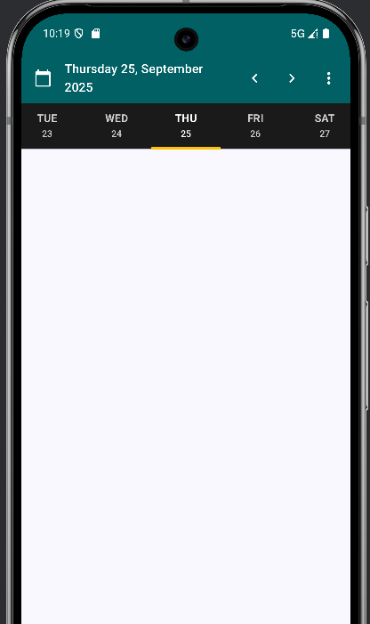
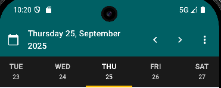
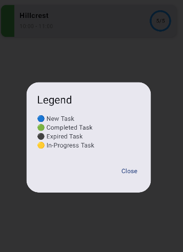

```markdown
# 📅 ScheduleViewJC

A modern Jetpack Compose-based weekly scheduling UI for Android, featuring dynamic day tabs, task cards with status indicators, and a top bar with week navigation and legend support.

---

## ✨ Features

- Weekly schedule view with horizontal paging
- Scrollable day tabs with dynamic styling
- Task cards with status-based color strips and progress indicators
- Top bar with week navigation and dropdown menu
- Legend dialog for task status icons

---

## 🖼️ Screenshots

### 🗓️ Weekly Schedule Screen  


### 📆 Top Bar with Navigation  


### 📋 Task Card with Progress  


### 📌 Legend Dialog  


---

## 🚀 Getting Started

### Prerequisites
- Android Studio Hedgehog or newer
- Kotlin 1.9+
- Jetpack Compose (Material 3)

### Clone the Project
```bash
git clone https://github.com/your-username/ScheduleViewJC.git
```

### Run the App
Open the project in Android Studio and run on an emulator or physical device.

---

## 🧩 Code Structure

- `MainActivity.kt` – Entry point and theme setup  
- `WeeklyScheduleScreen.kt` – Core layout with pager and top bar  
- `TaskList.kt` – LazyColumn rendering task cards  
- `DayTabs.kt` – Scrollable day tabs  
- `LegendDialog.kt` – Dialog showing task status icons

---

## 🗂️ Task Status Legend

| Icon | Status        | Color      |
|------|---------------|------------|
| 🔵   | New Task      | Blue       |
| 🟢   | Completed     | Green      |
| ⚫   | Expired       | Dark Gray  |
| 🟡   | In Progress   | Amber      |

---

## 📌 Notes

- Tasks are filtered by day using `LocalDate`
- Progress is visualized using `CircularProgressIndicator`
- Status colors are dynamically applied via `when` logic

---

## 📬 Contact

For questions or suggestions, feel free to reach out or open an issue.

```
